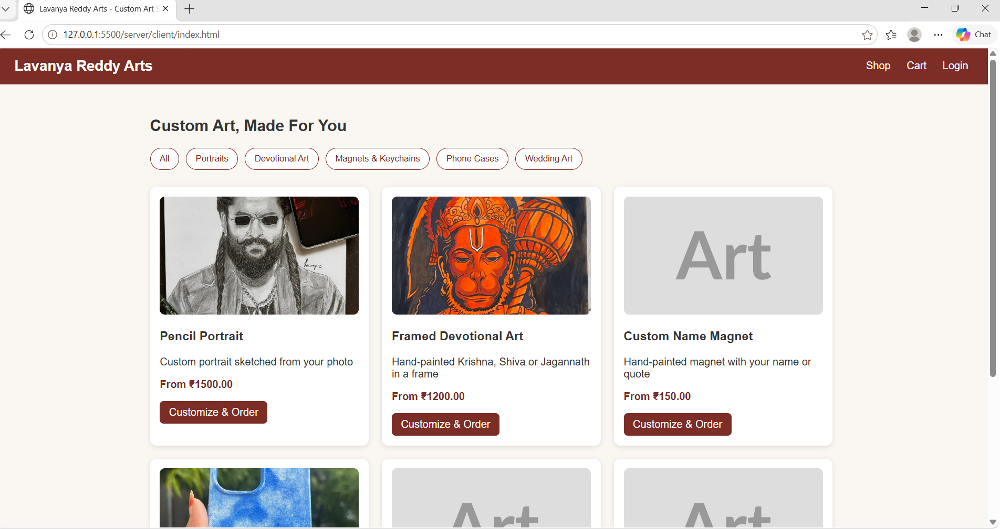
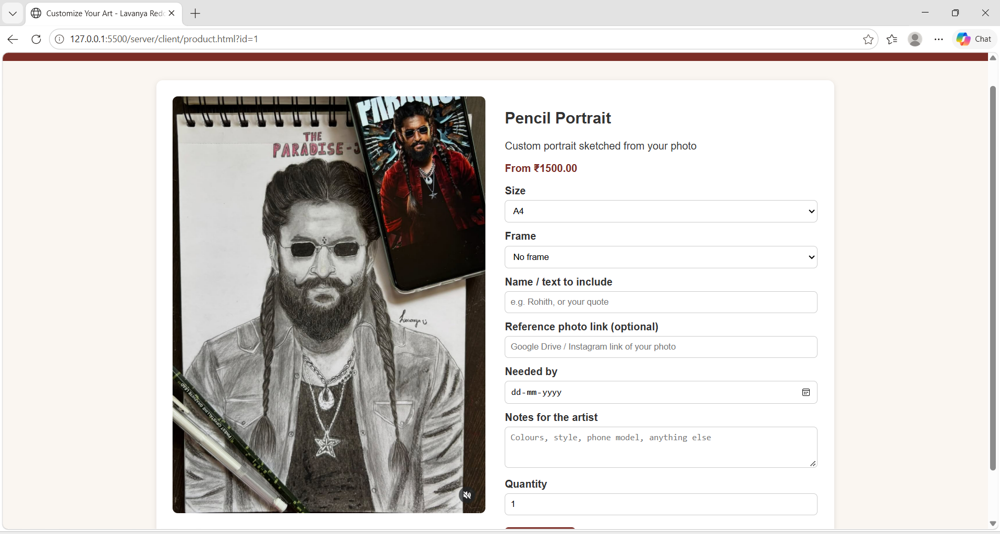
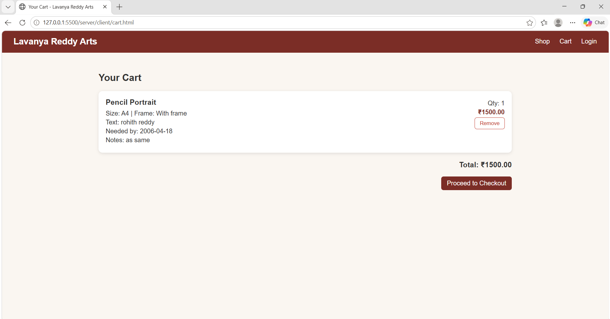
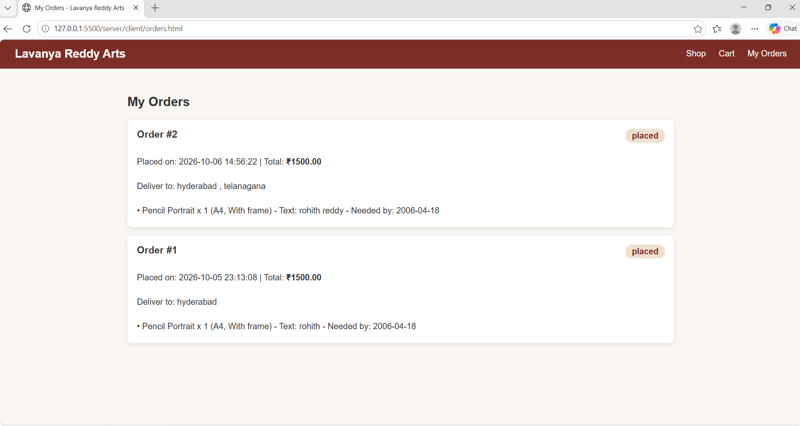
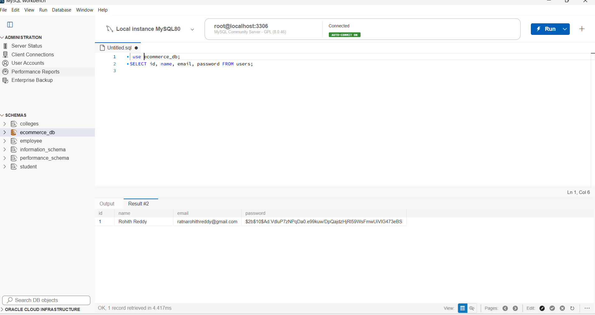

# Lavanya Reddy Arts - Custom Art E-commerce Store

A full-stack e-commerce website for custom hand-made art (portraits, devotional paintings, name magnets, phone cases, wedding art), built for the CodeAlpha Full Stack Development Internship (Task 1).

## Features
- Product listing with category filters
- Product details page with a customization form (size, frame, name/text, reference photo link, needed-by date, notes)
- Shopping cart with remove option and total
- User registration and login (passwords hashed with bcrypt, JWT authentication)
- Checkout and order processing saved in MySQL
- My Orders page showing order status and customization details

## Tech Stack
- Frontend: HTML, CSS, JavaScript
- Backend: Node.js, Express
- Database: MySQL
- Auth: bcryptjs, JSON Web Tokens

## How to Run
1. Install Node.js and MySQL.
2. Open MySQL and run the file `server/database.sql` to create the database, tables and sample products.
3. Open the `server` folder and install packages:
```
   cd server
   npm install
```
4. Copy `.env.example` to `.env` and fill in your MySQL password and a secret key.
5. Start the server:
```
   npm run dev
```
6. Open http://localhost:5000 in your browser.

## Folder Structure
```
server/
  server.js        API routes (products, auth, orders) and serves the website
  db.js            MySQL connection
  database.sql     Database tables and sample data
  client/          Website pages (HTML, CSS, JS) and images
```

## Screenshots
### Shop


### Product details with customization form


### Cart


### My Orders


### Passwords stored as hashes

## Author
Rohith Reddy - CodeAlpha Full Stack Development Intern
